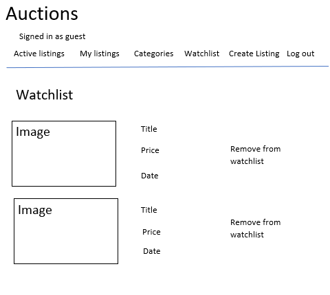
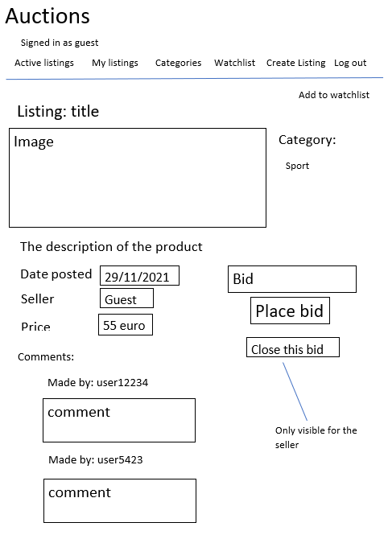
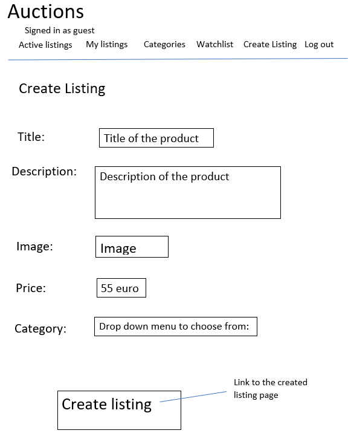
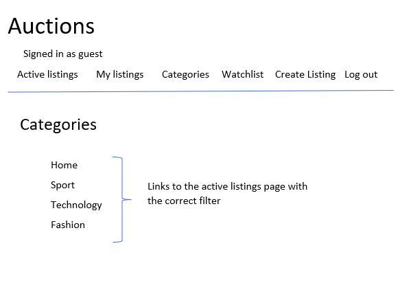

# Commerce

Commerce is a website where users can register and place listing aswell as bid on other people's listings.
The website is build using the Django web framework

## Databases

The website uses five classes in total to story the databases.
The fields of the attributes are fields using the django model object.

## Design

The top of the page can stay the same because it is part of the template that was provided at the beginning of the assignment.
There will be some extra feateres added, like My listings, categories, watchlist and create listing.

# Active listings page
The active listings page will be the homepage:

# My listings page
All listings made by the user will be shown.
The page will look almost identical to the active listings page

# Watchlist page
The watchlist page will look almost identical to the active listings page.
This page will only show the user listings on their watchlist.

# Listing page
The page for a single listing will look like this:

# Create listing
The User is also able to create new listings:

# Categories
The User is also able to filter based on category:

# Categories2
When the user filters by category they will go to a listings page with the correct filter:

